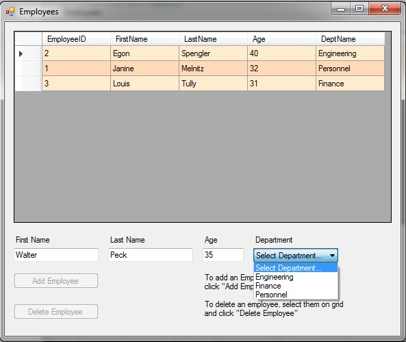
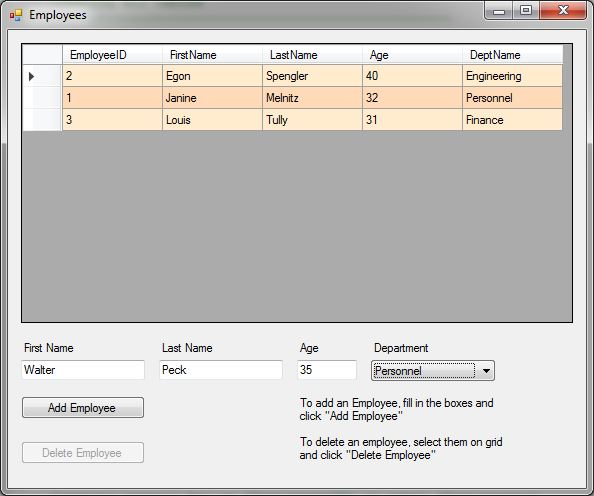
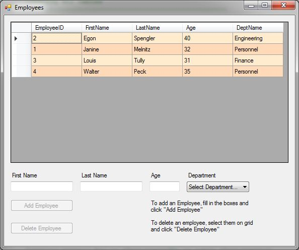
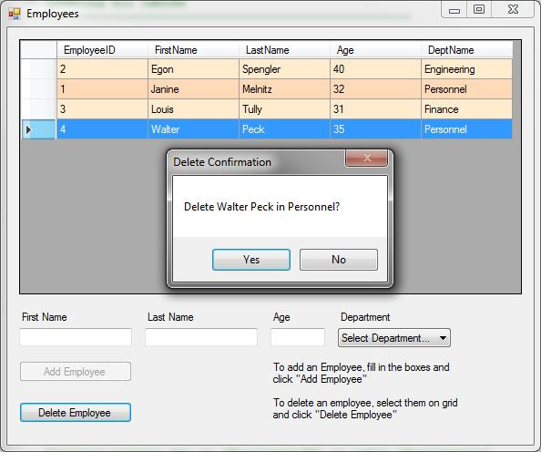
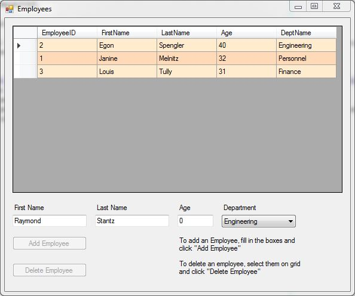
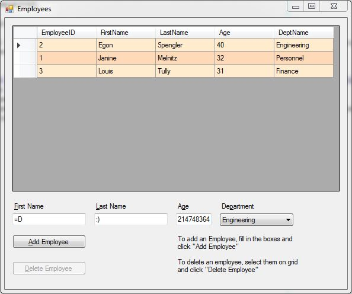

#DomainToDB

## What does this program do?
Provides a window/screen for entering and deleting employee records. The records are saved to a database.

## Course
[Enterprise Software Development II](https://www.bellevuecollege.edu/classes/All/PROG/210)

## Assignment
This assignment covered Entity Framework and its ability to generate the database from a model.

## Dependencies
- Entity Framework
- SQL Server (Course used 2012+)

## Notes
- I added keyboard shortcuts in the form of pressing the ALT key plus a letter that is underlined in the field's label
  or button text. For example, pressing ALT and 'a' will "click" the "Add Employee" button.
- I chose a different validation methodology than the instructor was wanting, with his permission.
- The two name textboxes just need something typed; the age textbox requires a non-zero positive whole number and the
  combobox needs a department selected.
- My method of validation lies with enabling and disabling the two buttons.
- All the fields (textboxes and comboboxes) need to be filled in to enable the "Add Employee" button.
- An employee has to be selected in the grid to enable the "Delete Employee" button.
- Only one button will ever be enabled at a time. Selecting an employee clears the boxes and selecting any of the boxes
  removes the selection from the grid.
- No data is pre-loaded by the SQL scripts; user will be presented with column headers only until an employee is added.

## Screen shots

