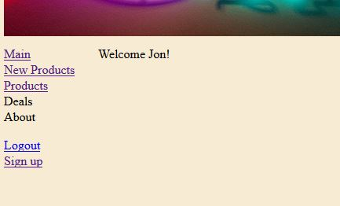
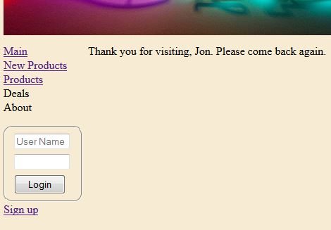
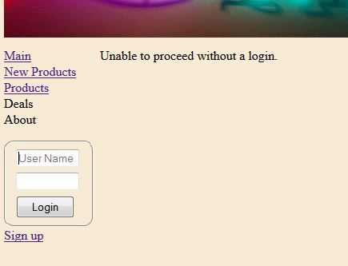
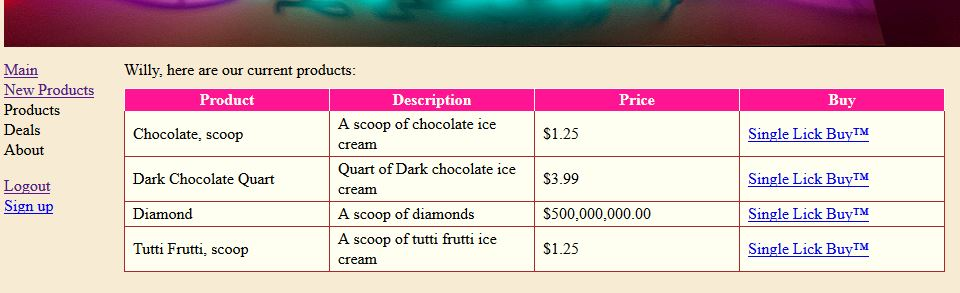
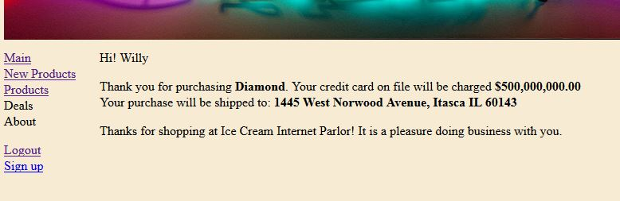
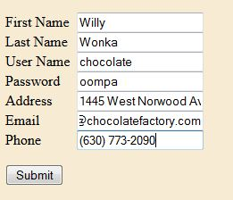
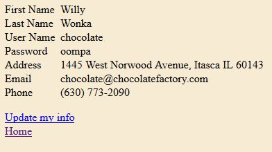
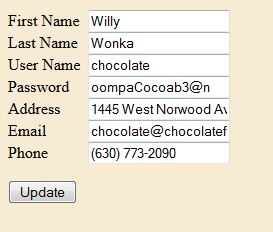
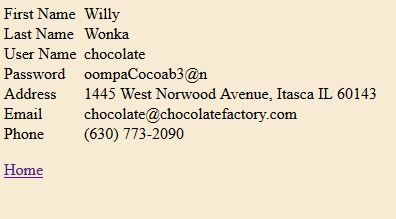

# Internet Ice Cream Parlor

## What does this program do?
It simulates an online store where an employee can add product and a customer can purchase a product one item at a time.

## Course
[Web Development II](https://www.bellevuecollege.edu/classes/All/PROG/117)

## Assignment
This is the final project. The course assignments all built upon this program.

## Dependencies
- ADO.Net 4.5
- SQL Server (Class used 2012+)

## Notes
- At the beginning of the course, we were asked what we wanted to "sell." I humorously chose ice cream.
- All SQL commands were sent in plain text; as commented upon in the code, the instructor kept reinforcing that this is
  not safe but that this facilitated the learning. Another [course](https://www.bellevuecollege.edu/classes/All/PROG/210)
  did show safer methods.
- Part of the assignment included emailing the customer when they purchased an item; however, this has been disabled due to
  the lack of password security for my gmail account being built in. The section of code is still present in the Page_Load
  method in the [oneclickBuy.aspx.cs](InternetIceCreamParlor/shopping/oneclickBuy.aspx.cs) file for review.
- The sign up pages were from an earlier assignment; their look was not updated to match the main page and product pages.
- When ordering a product, the user is presented with a humorous take on "one-click buy" in the form of "one lick buy".

## Screen shots
Note: These are not full screen images. Most have a sliver of the
[banner graphic](InternetIceCreamParlor/InternetIceCreamParlor/img/neonicecream.png)

When first launching, or arriving, at the web page.

A user logged in. Note the switch from login box to logout link.

A user logged out. The logout link reverts to the login box

A non-logged-in user will be returned to the main screen if they click on "New Products" or "Products."

A filled out new products page before clicking on the "Add Product" button.

The products page, with more products already added, showing the humorous &quot;Single Lick Buy&trade;&quot;

A user purchased diamond ice cream (the most expensive ice cream).

The next four images show the sign up process. Basically, a user fills out the information, is given a confirmation screen,
they are provided the means to update and then confirm the update. Note that these do not have the banner graphic

