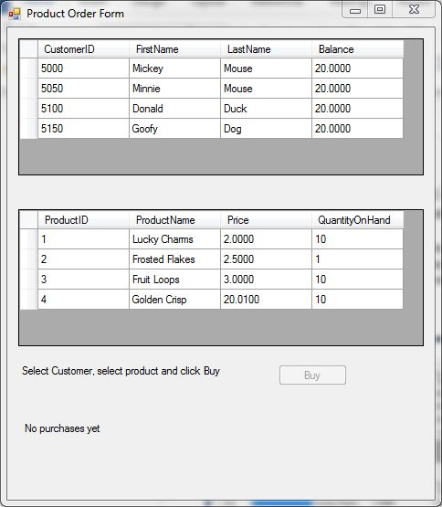
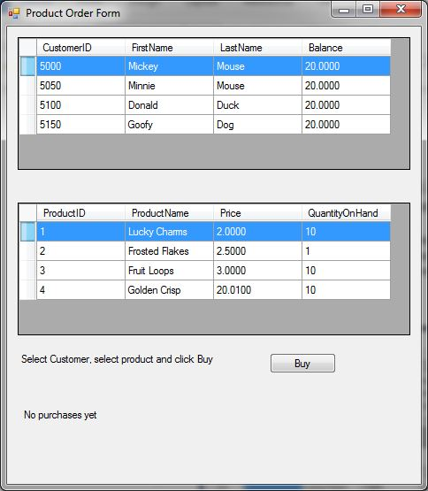
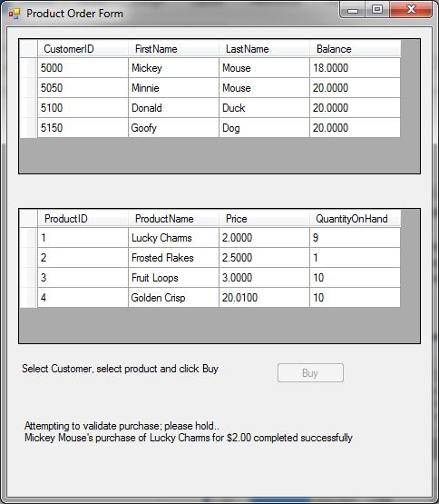
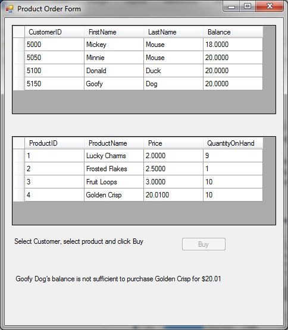
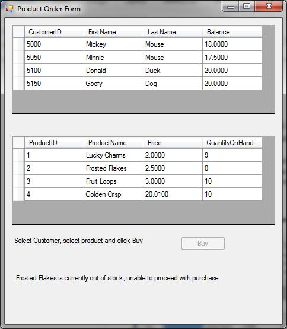
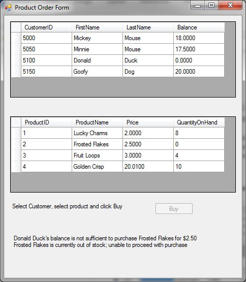

# PROG210LastHW

## What does this program do?
It simulates a product order window. The user selects a customer and selects what product, cereal in this case, the
selected customer would like to purchase. Clicking the buy button performs the purchase and updates the status bar in the
lower window.

## Course
[Enterprise Software Development II](https://www.bellevuecollege.edu/classes/All/PROG/210)

## Assignment
This is the last assignment for the course. We did not have a "course" project.

The instructor didn't go by modules, chapters, units or such. He named the assignments based mostly on what he taught that
week. In this particular case, instead of calling it something along the lines of "distributed transaction" he simply called it "Last Homework" or rather, "PROG210LastHW."

The assignment gave the class a chance to try out distributed transactions and communicating with a database
in the cloud (Azure).

## Dependencies
- Azure account (freebie okay) and a pre-created database.
- SQL Server (Class uses 2012+).

## Notes
- At the time of the assignment, Azure did not permit distributed transactions; only the local database was placed inside a
  transaction.
- The success of writing to the Azure database did calculate in commiting the transaction.
- There are two methods of validation; the buy button only enables when both a custonmer and a product is selected, and the
  update queries to both tables include a minimum check (to counter negatives) in their where clauses.
- For testing purposes, I programmed a double-click of either grid (dataGridView) forces a refresh for both. This allowed
  me to modify the values outside the program and continue testing without restarting.

### Screen shots

The program was just started. Customers and products are loaded from the two databases. No selections are made resulting
in the "Buy" button being disabled. 

A customer and product are selected, enabling the "Buy" button. 

A purchase is successful. 

A customer attempted to buy cereal without enough funds. 

A customer bought the last box of Frosted Flakes. 

A customer attempts to purchase an out-of-stock cereal. 

Both error messages can be triggered together. 

