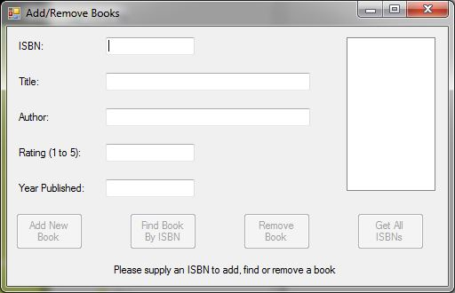
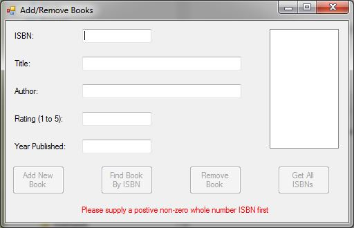
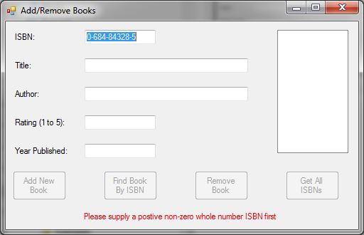
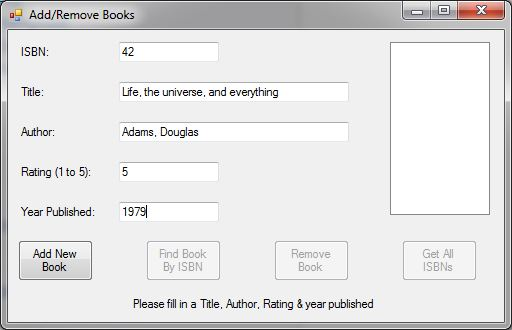
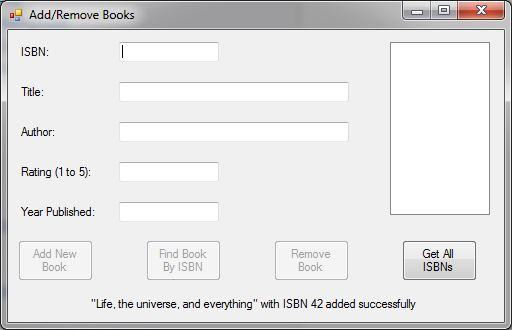
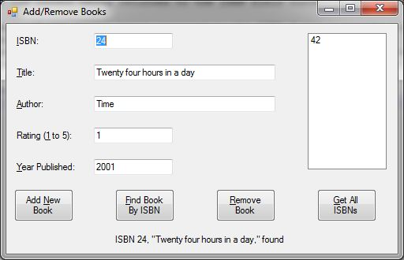
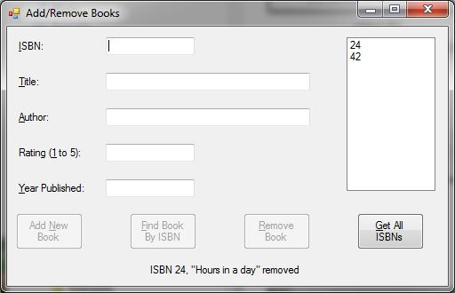
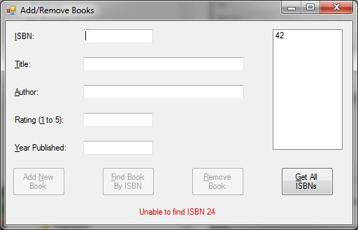
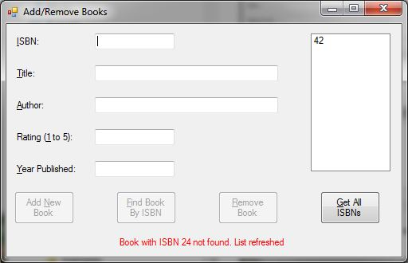

# Course Project

## What does this program do?
This application presents a form for adding, finding and removing books.

## Course
[Advanced Topics in OOP](https://www.bellevuecollege.edu/classes/All/PROG/260)

## Assignment
This was a more heavier graded assignment we were to work on over a few weeks along side the normal weekly assignments.

We used what we learned on binary search trees for this project.

## Dependencies
There are no external dependencies; it is compilable and executable as-is using Visual Studio.

## Notes
- A binary search tree is the "database."
- I used similar validation as in other assignments; disabling the action button until all the fields have proper values.
- Three buttons only require the "ISBN" textbox filled in.
- The "ISBN" is the key for the binary search tree and strictly an integer. Being the key, the cursor is returned to the
  textbox after button presses or if the user tries to move to another textbox with an invalid, or blank, ISBN.
- Instead of dialog windows, there is a "status line" at window bottom that shows information messages, in black, and
  error messages, in red.
- When the fields are populated by the find button, the add button is enabled due to all the fields having valid data.
  The entry cannot be re-saved; it will complain of already existing, but just changing the ISBN will not clear the other
  fields.
- Once there is at least one book record in the binary search tree, the "Get All ISBNs" button enables and generates the
  list of present ISBNs, which, as already mentioned, fills in all the fields. The list box is not automatically updated,
  so if an ISBN for a deleted book is clicked, an error status message is displayed and the list is updated.
- The instructor's method of removing entries from the binary search tree had four places where the tree node was actually
  removed. My method, based on my learning about binary search trees a few years back and utilizing Python, only has one
  place for fully removing the particular node (for removing a tree node with two children, the data was swapped with the
  nearest value to the node-to-be-removed's data value via the right-most left child. He allowed me, even encouraged me,
  to use my method, all the while noting in the instructions that he was expecting the class to follow his method
  utilizing the four places.
- While not in the instructions, I added a text box extension method that highlights any text in a textbox when it is
  given focus. I chose coding the [extension method](Prog260CourseProject\TextBoxExtensions.cs) over a normal method (or
  the two lines of code in place) to try out the extension feature.

### Screen shots
The application is launched.

User attempted to move away from the ISBN without entering a value.

User has filled in all the textboxes enabling the "Add New Book" button.

With a book added, the "Get all ISBN" button is enabled.

With at least a book added, the find and remove buttons enable when a validated ISBN is entered.

The user clicked on the "Find Book by ISBN" button, the book was successfully found and the fields filled with its
information

A book was removed after the user typed in its ISBN and clicked the "Remove book" button .

The user attempted to remove a book not found in the library.

User tried to find a non-existing book (ISBN key not found)

User deleted a book, then before updating the list, clicked on the deleted book's ISBN

